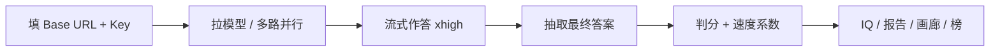

<p align="center">
  
</p>

<p align="center">
  
</p>

<h1 align="center">IQBench</h1>

<p align="center">
  <strong>模型智商测评台</strong> · 给 OpenAI 兼容网关用的推理评测台<br>
  填地址和 Key，拉模型，一键并行。对一半是 100。
</p>

<p align="center">
  
  
  
  
</p>

---

测的不是聊天顺不顺口，是模型会不会独立想：最坏保证、抗背题、空间作图、指令是否真的听进去。

<p align="center">
  
  <br>
  <sub>签名题 Q16：手写 HTML + SVG 鹈鹕骑车，禁止位图 / canvas / 外链图。</sub>
</p>

## 它测什么

| 维度 | 权重 | 单元 | 在查什么 |
| --- | ---: | --- | --- |
| 认知反射 | 1.0 | Q1–Q3 | 会不会被第一直觉带走 |
| 多步科学 | 2.0 | Q4–Q5 | 色盲遗传、阿基米德排水 |
| 最坏保证 | 2.5 | Q6–Q7 | 经典糖果题 + 袜子配对参数化 |
| 抗记忆 | 2.5 | Q8–Q9 | 换数字后还会不会默写 21 / 0.05 |
| 模式归纳 | 2.0 | Q10–Q11 | 数列、字母类比 |
| 形式逻辑 | 1.5 | Q12 | 骑士与无赖（参数化） |
| 约束满足 | 1.5 | Q13 | 五人排队（参数化） |
| 数量 | 1.2 | Q14 | 注排水 |
| 注意 | 0.8 | Q15 | 数字母（不用 strawberry） |
| 空间作图 | 1.0 | Q16a | 鹈鹕、脚在脚踏上、轮子转 |
| 指令遵循 | 0.6 | Q16b Q17 | id / viewBox / 严格 JSON |

18 个计分单元，卷面 163。完整规则在 [iqbench-spec.md](./iqbench-spec.md)。

## 分数怎么来

```
IQ = round(100 + 90 × (加权通过率 − 0.5))
```

| | |
| --- | --- |
| 量程 | 55–145 |
| 100 | 加权后对一半 |
| 半分 | 有卷面，不进 IQ（21 的 29、17 的 25） |
| 速度 | 只调卷面，不调 IQ |
| 同档 | 差 < 20 或 95% 区间重叠 |

参数化题每次会话换实例，答案由求解器算，不是一张死卷。



## 很快跑起来

```bash
git clone https://github.com/yclenove/iqbench.git
cd iqbench
npm install
npm run dev
```

浏览器打开 `http://localhost:8080`。

1. API Base URL 填到 `/v1`
2. Key 只在本标签页用，不要写进 `.env`
3. 拉模型 → 勾选 → 一键测评
4. 看成绩表、鹈鹕画廊、导出 HTML 报告

```bash
npm run build
npm run preview
```

## 设计上的硬规矩

- **Key 不入库、不上报、不进 Git。** 默认 `sessionStorage`，关页即清。
- 思考级别固定 **xhigh**，流式输出，网络抖动会重试。
- 切 Key 换作用域：上一把的成绩不会串到下一把。
- 游客成绩留在这台浏览器；登录后才同步、才进公开模型榜 / 渠道榜。
- 画廊只认内联 SVG。思考过程里写到 canvas 不再误杀整题。
- 可选「渠道鉴定」：知识阶梯估计训练截止（铺到 2026Q3）、juice 探针抓 Codex 反代、太新的事件答对了就标疑似联网。全部不计分。
- 降智对照：跑完自动跟全网同名模型的分数分布比，显著偏低标「疑似降智渠道」（样本 ≥5、低于中位 12 分且不超下四分位才指认）。
- 榜单带鉴定：模型榜显示知识新旧（季度），渠道榜显示 ⚠ 联网 / juice / 降智标记，一眼看出哪家中转干净。
- 网络重试：对话流 4 次退避重试（含 5xx/408/429/断连），拉模型、云同步、对照拉取各带 3 次重试；云端写入幂等，重复提交不会重复计数。

## 仓库里有什么

```
src/lib/questions.ts   题库、参数化、IQ 公式
src/lib/judge.ts       抽取、判分、鹈鹕几何
src/lib/generators.ts  袜子 / 球拍 / 逻辑 / 排队求解器
src/lib/probes.ts      渠道鉴定：知识阶梯 / juice / 联网嫌疑（不计分）
src/lib/report.ts      导出的精美 HTML 报告
docs/                  README 用的图
iqbench-spec.md        给外部模型 review 的完整规格
```

## 安全

不要提交 API Key、`.env`、测评原始日志。  
`.gitignore` 已排除 `.env*` 和本地产物。页面输入框才是放 Key 的地方。

## 许可

私人项目。未另声明前，不要公开发布别人的 Key 或渠道地址。
