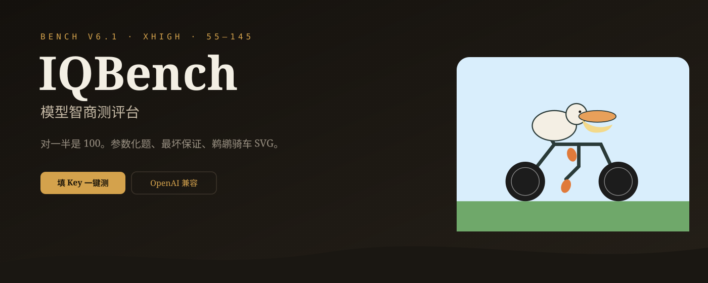
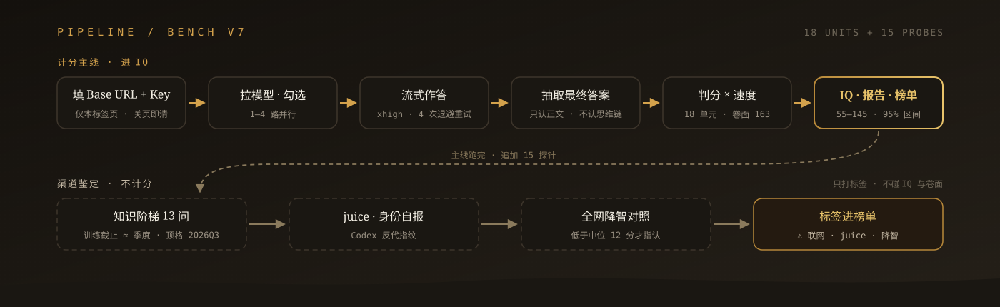
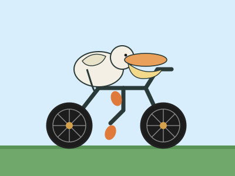

<p align="center">
  
</p>

<p align="center">
  
</p>

<h1 align="center">猛蹬·145</h1>

<p align="center">
  <strong>我就看智商能低到什么程度</strong><br>
  填地址和 Key，拉模型，一键并行。对一半是 100。
</p>

<p align="center">
  
  
  
  
  
  <a href="https://linux.do"></a>
</p>

---

测最坏保证、抗背题、空间作图、指令遵循这类硬指标，不测聊天顺不顺口。跑完附带一份渠道鉴定：训练截止到哪个季度、有没有偷偷联网、是不是 Codex 反代、有没有降智。

<p align="center">
  
</p>

## 它测什么

| 单元 | 维度 | 权重 | 在查什么 |
| :--- | :--- | ---: | :--- |
| Q1–Q3 | 认知反射 | 1.0 | 会不会被第一直觉带走 |
| Q4–Q5 | 多步科学 | 2.0 | 色盲遗传、阿基米德排水 |
| Q6–Q7 | 最坏保证 | 2.5 | 经典糖果题 + 袜子配对（参数化） |
| Q8–Q9 | 抗记忆 | 2.5 | 换数字后还会不会默写 21 / 0.05 |
| Q10–Q11 | 模式归纳 | 2.0 | 数列、字母类比（参数化） |
| Q12 | 形式逻辑 | 1.5 | 骑士与无赖（参数化） |
| Q13 | 约束满足 | 1.5 | 五人排队（参数化） |
| Q14 | 数量 | 1.2 | 注排水 |
| Q15 | 注意 | 0.8 | 数字母（不用 strawberry） |
| Q16a | 空间作图 | 1.0 | 鹈鹕、脚在脚踏上、轮子转 |
| Q16b Q17 | 指令遵循 | 0.6 | id / viewBox / 严格 JSON |

18 个计分单元，卷面 163。参数化题每次会话换实例，答案由求解器算，不是一张死卷。Q16 鹈鹕在真实 DOM 里渲染测几何（`getBBox`/`getCTM`），不靠正则猜。完整规则在 [iqbench-spec.md](./iqbench-spec.md)。

<p align="center">
  
  <br>
  <sub>签名题 Q16：手写 HTML + SVG 鹈鹕骑车，禁止位图 / canvas / 外链图。</sub>
</p>

## 分数怎么来

```
IQ = round(100 + 90 × (加权通过率 − 0.5))
```

| 规则 | 说明 |
| :--- | :--- |
| 量程 | 55–145，加权后对一半 = 100 |
| 半分 | 只进卷面，不进 IQ（如 21 的 29、17 的 25） |
| 速度系数 | 只调卷面，不调 IQ |
| 并列判定 | 分差 < 20 或 95% 置信区间重叠视为同档 |

## 渠道鉴定

主测评之后追加 15 个探针，可开关，全部不计分：

| 探针 | 原理 | 输出示例 |
| :--- | :--- | :--- |
| 知识阶梯 13 问 | 客观事件从 2023Q4 铺到 2026Q3，答对的最晚季度即训练截止 | `知识≈2025Q4（8/13）` |
| 联网嫌疑 | 顶格事件训练数据覆盖不到，答对说明网关注入了搜索 | `⚠ 疑似联网` |
| juice 探针 | Codex CLI 独有的注入参数，正常 API 渠道没有 | `juice=128（疑似 Codex 反代）` |
| 身份自报 | 记录模型自称，仅供对照，不做判定 | `自称 gpt-5.2` |
| 降智对照 | 对全网同名模型公开分布，样本 ≥5 且低于中位 12 分才指认 | `→ 疑似降智渠道` |

结果进成绩卡、HTML 报告和榜单：模型榜多一列知识季度，渠道榜按主机聚合 ⚠ 联网 / juice / 降智标记。

知识阶梯的事件表在 `src/lib/probes.ts`，会随时间过期，最新条目距今超 90 天时界面会提醒。

## 跑起来

```bash
git clone https://github.com/yclenove/iqbench.git
cd iqbench
npm install
npm run dev
```

浏览器打开 `http://localhost:8080`。

1. API Base URL 填到 `/v1`
2. Key 只在本标签页用，不要写进 `.env`
3. 拉模型 → 勾选 → 一键测评
4. 看成绩表、鹈鹕画廊、渠道鉴定，导出 HTML 报告

```bash
npm test           # 判分器 / 生成器 / 探针的真源码测试
npm run typecheck
npm run build && npm run preview
```

## 测评跑在哪

模型**不在你电脑上跑**，也不走猛蹬自己的额度。浏览器出题、计时、判分；推理发生在你填的那个网关上。

```
浏览器  →  猛蹬服务器 /api/bench/chat  →  你的网关 /v1/chat/completions
           （转发，防 CORS）                （你的 Key、你的 token）
```

| 环节 | 在哪 | 说明 |
| :--- | :--- | :--- |
| 出题 / 并发 / 计时 / 判分 | 你的浏览器 | Q16 也在本机 DOM 里量 SVG |
| 拉模型、对话转发 | 猛蹬服务器 | 浏览器不能直连多数网关 |
| 模型推理 | 你填的 API | 费用和思考都在那一侧 |
| 本场成绩 | 本机 `localStorage` | 关页还在，换浏览器没有 |
| 公开榜 | 线上数据库 | **登录后**才写入（L站 / Google / X） |

## Key 会过服务器

会。转发必须带上 `Authorization`，Key **会经过猛蹬这台机器**，但只在这一次请求的内存里。

- **不写数据库、不写日志、不进 Git、不进榜单、不拿去调别的接口**
- 上游报错里出现的 Key 会打码再回给浏览器
- 云端只留主机名（可脱敏）和 Key 的指纹，用来切作用域、不上报明文
- 默认放 `sessionStorage`，关标签即清；勾了「记住」才留在本机

做不到「Key 完全不经过这台机器」。要零过手：自己 clone 本仓库本地跑（请求仍经你自己的 `localhost`），或给网关开 CORS 后改成浏览器直连。

公开榜需要登录，不是只有 L 站：L站（需 TL1+）、Google、X 都可以。游客测完只留本机。未完成场次不上公开榜。

## 设计上的硬规矩

- **Key 明文不入库、不上报、不进 Git。** 过手转发见上一节。
- 思考级别固定 **xhigh**，流式输出；对话流 4 次退避重试，拉模型 / 云同步 / 对照拉取各带 3 次，云端写入幂等。
- 切 Key 换作用域：上一把的成绩不会串到下一把。
- **断点续测：** 每题写入本机草稿。刷新后点「继续」，不会自动开跑。只重试网络/空答/中止，判错的不刷。题库换代的旧草稿作废。
- 游客成绩留在这台浏览器；登录后才同步、才进公开模型榜 / 渠道榜。
- 画廊只认内联 SVG。思考过程里写到 canvas 不再误杀整题。
- 鉴定和对照只打标签，不碰 IQ、不碰卷面，指认阈值偏保守。

## 仓库里有什么

```
src/lib/questions.ts   题库、参数化、IQ 公式
src/lib/judge.ts       抽取、判分、鹈鹕 DOM 几何
src/lib/generators.ts  袜子 / 球拍 / 逻辑 / 排队求解器
src/lib/probes.ts      渠道鉴定：知识阶梯 / juice / 联网嫌疑
src/lib/bench-draft.ts 未完成草稿、续测 / 失败重试
src/lib/bench-store.ts 本地存档、榜单聚合、降智指认
src/lib/bench-db.ts    云同步、公开榜、全网基线
src/lib/report.ts      导出 HTML 报告
migrations/            数据库结构（两个后端自动套用）
scripts/verify-src.test.mjs  真源码打包直测，防测试漂移
docs/                  README 用的图
iqbench-spec.md        给外部模型 review 的完整规格
```

## 安全

不要提交 API Key、`.env`、测评原始日志。  
`.gitignore` 已排除 `.env*`、`linuxdo.secrets.*` 和本地产物。页面输入框才是放 Key 的地方。

托管版会把对话请求转到你的网关，因此 Key 会过服务器内存。自己部署则只过你自己的进程。

## 友情链接

本项目认可并感谢 [LINUX DO](https://linux.do) 社区。登录、讨论渠道和题库都欢迎来 L 站。

- [LINUX DO](https://linux.do)

## 许可

私人项目。未另声明前，不要公开发布别人的 Key 或渠道地址。
